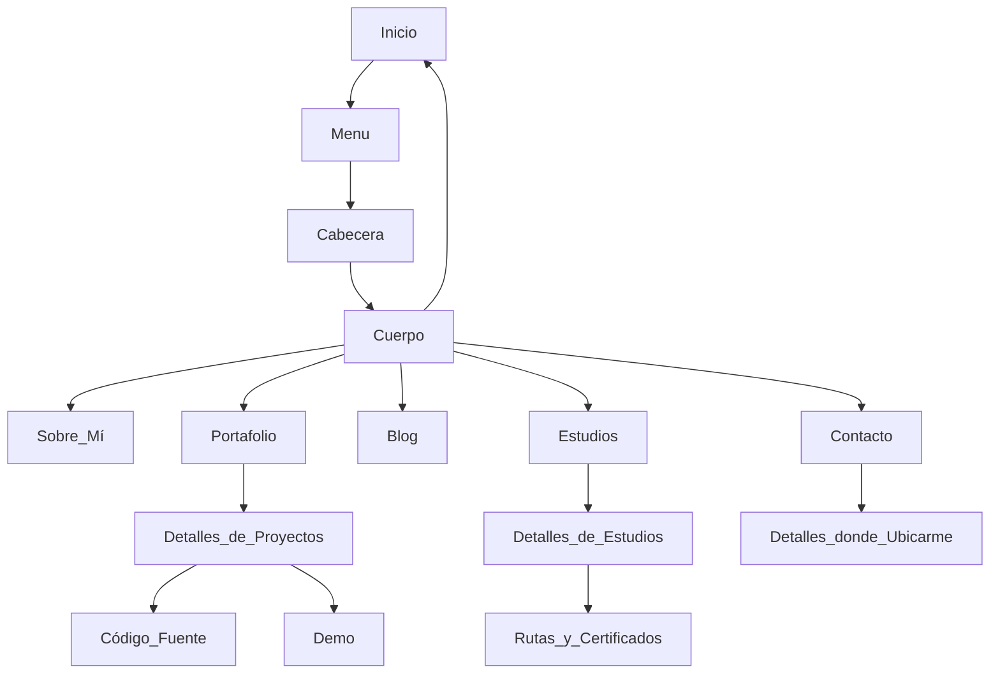

# Portafolio-CV

🗣️ Versión en Español

Portafolio-CV es mi página personal que utilizo para mostrar mis habilidades, destrezas, mi blog personal y mis proyectos.
  

<h2 style="color: orange;">Tabla de contenidos</h2>

- [Entorno de configuración](#entorno-de-configuración)
- [Estructura](#estructura)
- [Diagrama de Flujo](#diagrama-de-flujo)
- [Deploy](#deploy)
- [Colaboradores](#colaboradores)
- [Instrucciones de Uso](#instrucciones-de-uso)
- [Agradecimientos](#agradecimientos)
  

<h2 style="color: orange;">Entorno de configuración</h2>

Este es un entorno personalizado y configurado desde cero usando HTML, CSS y JavaScript. Está diseñado para ser visualizado en cualquier dispositivo, incluyendo PC, tablet o celular. Se han utilizado estas tecnologías ya que son las que manejo con mayor destreza.

<h2 style="color: orange;">Estructura</h2>

La estructura de la página Portafolio-CV está configurada en 3 componentes principales:
  
### **Menú**

El menú consta de 8 iconos organizados de manera clara para proporcionar la información que el usuario desea visualizar.

### **Cabecera**

La cabecera está compuesta por dos secciones:

1. Información personal: Mi nombre, profesión y enlaces a mis redes sociales.
2. Contacto y descarga: Opciones para ponerse en contacto conmigo y descargar mi currículum.

### **Cuerpo**

El cuerpo de la página se divide en 6 secciones:

1. Inicio
2. Sobre mí
3. Estudios
4. Portafolio
5. Contáctame

Cada sección muestra la información correspondiente según su categoría.

La página también cuenta con un modo oscuro como opción adicional al modo claro.
  

<h2 style="color: orange;">🔗 Diagrama de Flujo</h2>

El diagrama de flujo ilustra la interacción entre las diferentes secciones y componentes de la página Portafolio-CV.

 
<h2 style="color: orange;">⬇ Deploy</h2>

Si deseas mejorar o modificar este proyecto, te invito a clonarlo y ejecutarlo en tu entorno local siguiendo los siguientes pasos:

1. **Clona el repositorio:** git clone https://github.com/alejandrorndev/portafolio.git

2. Realiza las mejoras o modificaciones deseadas.

3. ¡Despliega tu versión mejorada de Portafolio-CV!
  

<h2 style="color: orange;">Colabordores</h2>

- Alejandro
- Youtube
- Diego
  

<h2 style="color: orange;">Instrucciones de Uso</h2>

1. Clona el repositorio [Portfolio-cv](https://github.com/alejandrorndev/portafolio.git).

2. Realiza mejoras, agrega nuevas funcionalidades, rompe cosas, inventa, ¡pero sobre todo, nunca dejes de intentarlo!

3. Despliega tu propia versión de Portafolio-CV y compártela con el mundo.
  

<h2 style="color: orange;">Agradecimientos</h2>

Quiero agradecer a Diego por su gran aporte a este proyecto. Sin su apoyo, no habría sido posible lograr este resultado.

¡Gracias a todos por su tiempo y atención!

---
 
Este proyecto está bajo la licencia [MIT](./LICENSE).
 